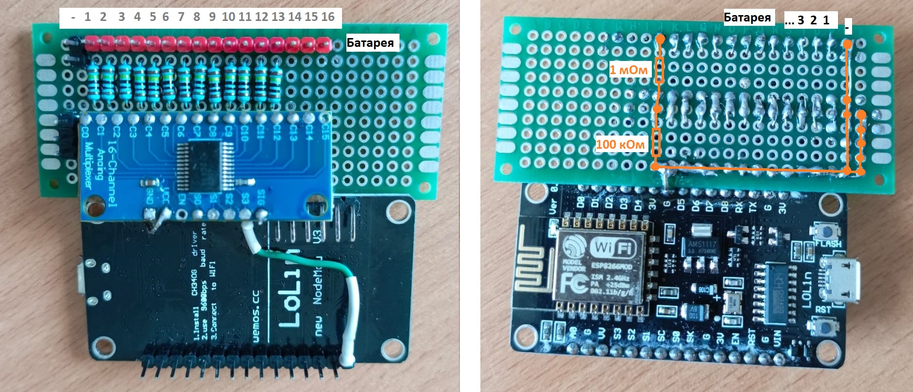
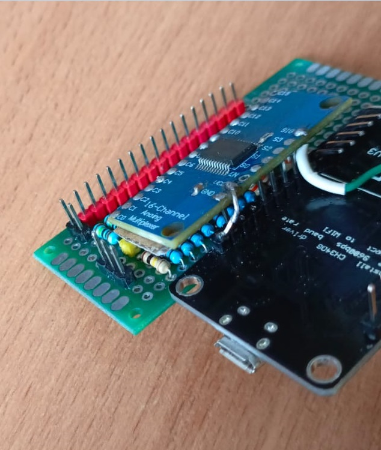
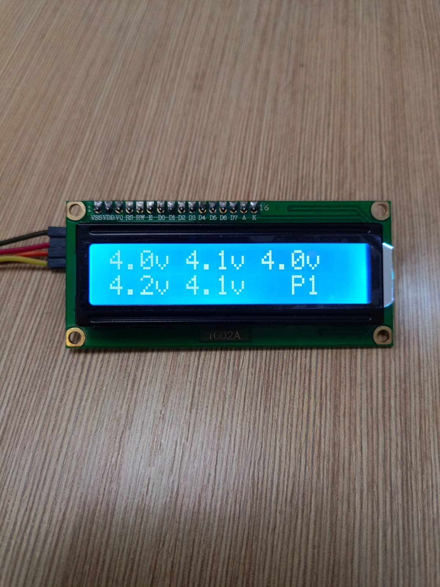
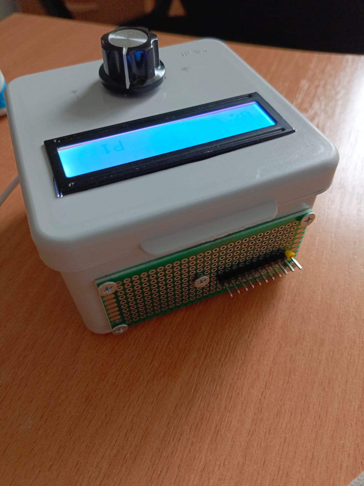
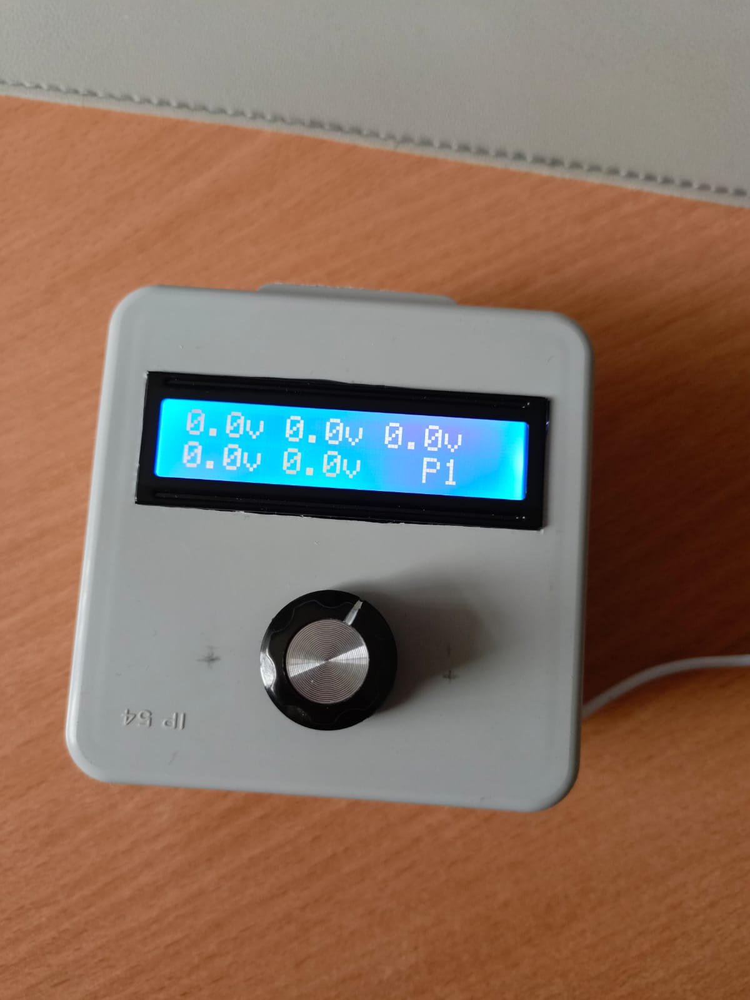
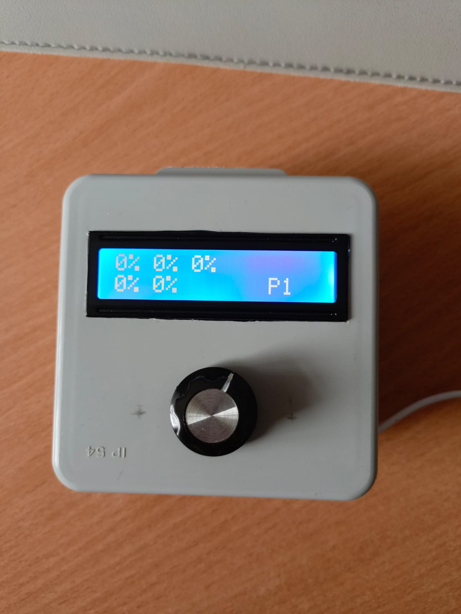

# voltmetr_13S_8266_kompensation_Display_1610_Encoder
* Мониторинг напряжения аккумуляторов подключенных по схеме до 13s.
* Делитель напряжения для аккумуляторных батарей собран 1мОм и 100кОм подключен через мультиплексор (CD74HC4067 module 16-канальный).
* Код снабжён комментариями, разобраться будет не сложно.

# Плата

Мониторинг напряжения аккумуляторов подключенных по схеме до 10s
Дисплей 1610 для отображения состояния аккумуляторов.
Энкодер для переключения страниц (1-2) и режимов (напряжение или проценты)

    
    

# Функции:
* При вращении ручки энкодера переключаютсястраницы с аккумуляторами
* Если нажать и держивать кнопку энкодера, то отображаются проценты заряда аккумуляторов
* Wifi в режиме точки доступа 
* Основная Веб страница с данными о подключенных аккумулаторах: http://battery-monitor.local
* Страница настроек: http://battery-monitor.local/s

# Готовое устройство, проект реализован полностью.
Контакты обозначены, желтый вывод [минус первого АКБ]!

    
    
     

## Лицензия

Этот проект лицензирован под MIT License. См. файл [LICENSE](LICENSE) для получения подробной информации.
