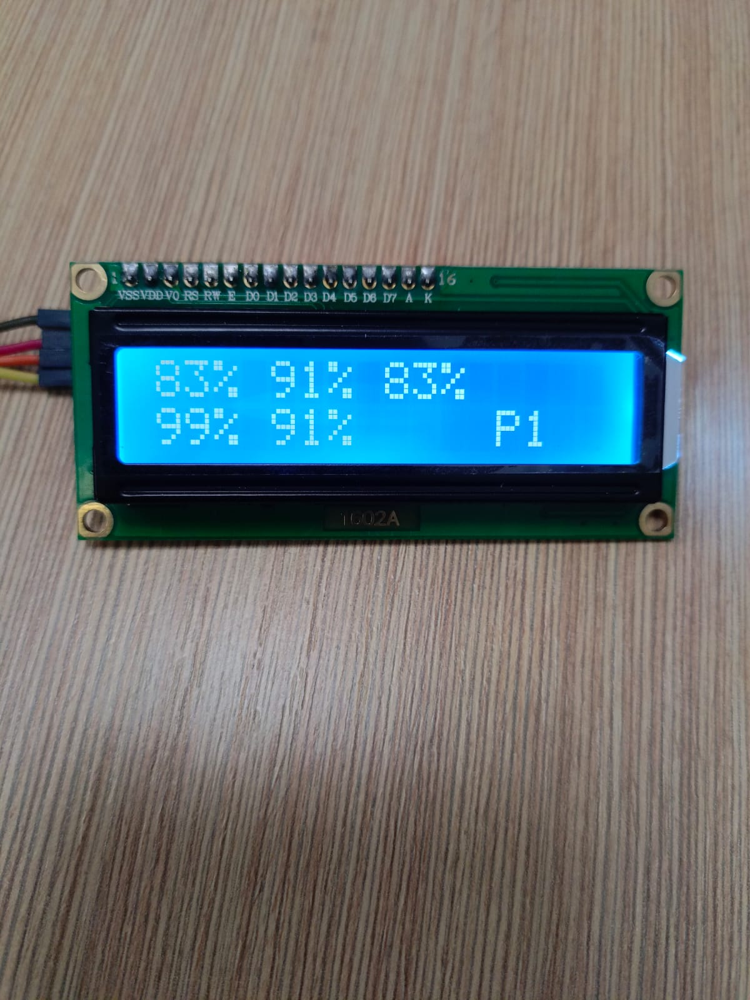

# voltmetr_10S_8266_kompensation_Display_1610
Мониторинг напряжения аккумуляторов подключенных по схеме до 10s
Добавлен дисплей 1610 для отображения состояния аккумуляторов.
Добавлены две кнопки для переключения страниц (1-2) и режимов (напряжение или проценты)

